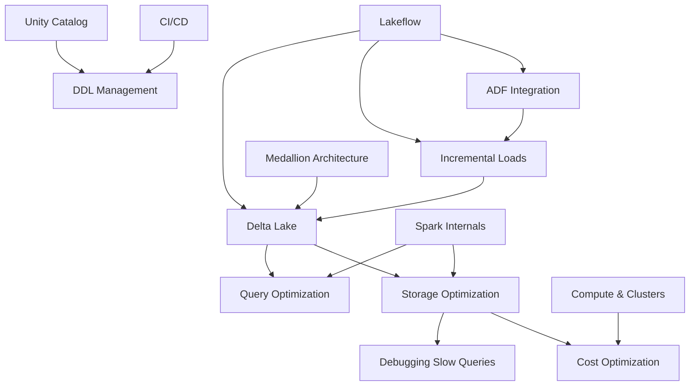

# 🧱 Databricks — Complete Guide for Data Engineers

> [!abstract] About this vault
> A comprehensive, beginner-friendly knowledge base covering everything a Data Engineer needs to know about Databricks. Each topic is a separate note — click any link to dive deeper.
>
> **Stack:** Databricks, Delta Lake, PySpark, Spark SQL, Azure (ADLS, ADF), Unity Catalog

---

## 📚 Core Concepts

| #   | Topic                           | What you'll learn                                                         |
| --- | ------------------------------- | ------------------------------------------------------------------------- |
| 1   | [[01 - What is Databricks]]     | Platform overview, Lakehouse architecture                                 |
| 2   | [[02 - Delta Lake]]             | Parquet + transaction log, MERGE, time travel, managed vs external tables |
| 3   | [[03 - Medallion Architecture]] | Bronze / Silver / Gold — why you need all three                           |
| 4   | [[04 - Unity Catalog]]          | 3-level namespace, governance, permissions                                |

## ⚙️ Spark Engine

| # | Topic | What you'll learn |
|---|-------|-------------------|
| 5 | [[05 - Spark Internals]] | Partitions, shuffle, repartition vs coalesce, data skew, spill |
| 6 | [[06 - Storage Optimization]] | OPTIMIZE, Z-ORDER, Liquid Clustering, VACUUM, autoOptimize, small file problem |
| 7 | [[07 - Query Optimization]] | Predicate pushdown, AQE, broadcast joins |
| 8 | [[08 - Window Functions]] | ROW_NUMBER, RANK, LAG, LEAD, running totals — the 5 essential patterns |

## 🏗️ Infrastructure & Operations

| # | Topic | What you'll learn |
|---|-------|-------------------|
| 9 | [[09 - Compute and Clusters]] | Cluster types, serverless, spot instances, auto-terminate |
| 10 | [[10 - ADF Integration]] | Activities, SHIR, triggers, pipeline patterns |
| 11 | [[11 - Incremental Loads]] | Watermark pattern, hard delete detection, CDC |
| 12 | [[12 - CICD for Databricks]] | Asset Bundles, Azure DevOps, testing, promotion |
| 13 | [[13 - DDL Management]] | Migration scripts, idempotent DDL, per-environment catalogs |

## 💰 Operations & Tuning

| # | Topic | What you'll learn |
|---|-------|-------------------|
| 14 | [[14 - Cost Optimization]] | Storage tiering, compute savings, monitoring |
| 15 | [[15 - Debugging Slow Queries]] | 7-step framework, Spark UI, top 5 root causes |
| 16 | [[16 - Databricks vs Snowflake]] | Head-to-head comparison, when to use which |
| 17 | [[17 - Lakeflow]] | Lakeflow Connect, Declarative Pipelines (DLT), Jobs, Designer — Databricks' unified DE solution |

---

## 🔗 Key Relationships

