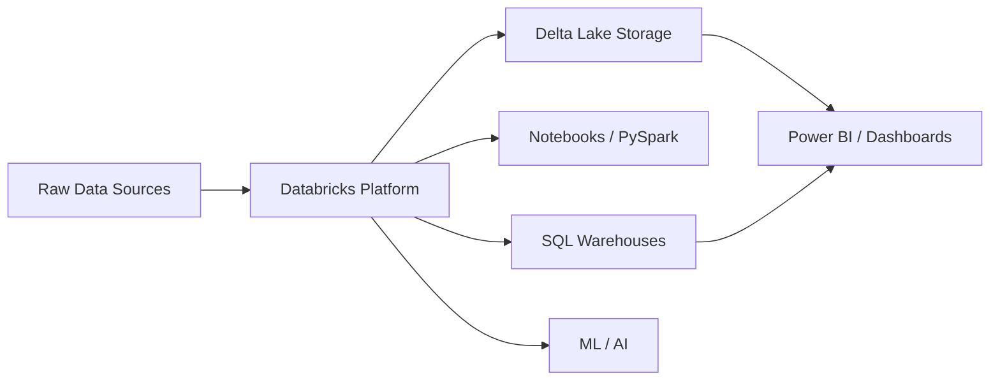
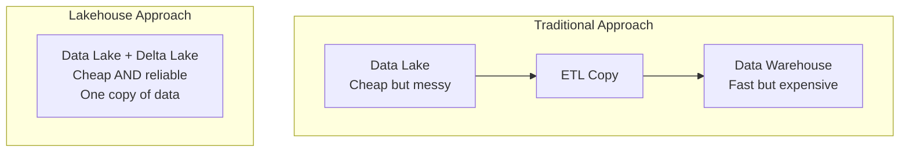

# What is Databricks?

> [!info] Related notes
> [[02 - Delta Lake]] | [[03 - Medallion Architecture]] | [[09 - Compute and Clusters]]

Databricks is a **unified data platform** built on top of Apache Spark. It provides:

- A managed Spark environment (you don't install or manage Spark)
- [[02 - Delta Lake|Delta Lake]] for reliable data storage
- Notebooks for interactive development
- Job scheduling for production pipelines
- [[04 - Unity Catalog|Unity Catalog]] for data governance
- SQL Warehouses for BI queries

## The Lakehouse Architecture

The Lakehouse combines the best of **data lakes** (cheap storage, flexible formats) and **data warehouses** (ACID transactions, schema enforcement, fast queries).

| Feature | Data Lake | Data Warehouse | Lakehouse |
|---------|-----------|----------------|-----------|
| Storage cost | Low | High | Low |
| ACID transactions | No | Yes | Yes ([[02 - Delta Lake|Delta Lake]]) |
| Schema enforcement | No | Yes | Yes |
| UPDATE / DELETE | No | Yes | Yes (Delta MERGE) |
| Open format | Yes (Parquet) | No (proprietary) | Yes (Parquet + Delta log) |
| ML support | Good | Poor | Good |
| BI / SQL support | Poor | Good | Good |

> [!tip] One-liner
> "Databricks is where you process data. Delta Lake is how you store it. Unity Catalog is how you govern it."

A Lakehouse doesn't copy data from a lake to a warehouse. It adds warehouse-like capabilities (ACID, schema, SQL) directly on top of the lake. **One copy of data, all capabilities.**

---

**Next:** [[02 - Delta Lake]] →
