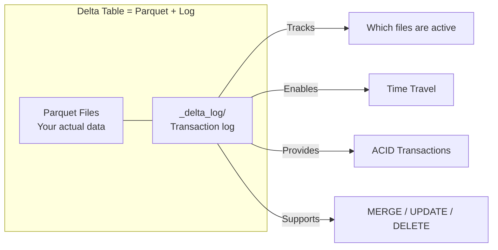

# Delta Lake

> [!info] Related notes
> [[01 - What is Databricks]] | [[06 - Storage Optimization]] | [[05 - Spark Internals]] | [[11 - Incremental Loads]]

## What is Delta Lake?

Delta Lake is **NOT a new file format**. It's a **transaction layer on top of Parquet**. The data files are regular Parquet files. The magic is the `_delta_log/` folder that tracks every change.

> [!tip] Interview one-liner
> "Delta Lake is not a new file format. It's a transaction layer ON TOP of Parquet. The data is Parquet. The magic is the log."

## What's inside a Delta table on disk

```
/silver/claims/                          ← This IS "the Delta table"
│
├── _delta_log/                          ← Transaction log (the magic)
│   ├── 00000000000000000000.json        ← Commit #0 (table created)
│   ├── 00000000000000000001.json        ← Commit #1 (first append)
│   ├── 00000000000000000002.json        ← Commit #2 (update)
│   └── 00000000000000000010.checkpoint.parquet  ← Checkpoint
│
├── part-00000-abc123.snappy.parquet     ← Actual data (regular Parquet)
├── part-00001-def456.snappy.parquet     ← Actual data
└── part-00002-ghi789.snappy.parquet     ← Actual data
```



## Delta vs Parquet

| Feature | Parquet only | Delta Lake (Parquet + log) |
|---------|-------------|--------------------------|
| Data files on disk | `.snappy.parquet` | `.snappy.parquet` (identical!) |
| Transaction log | No | Yes (`_delta_log/`) |
| MERGE INTO | No | Yes |
| UPDATE / DELETE | No (immutable) | Yes (rewrites files) |
| Time Travel | No | Yes (`VERSION AS OF`) |
| ACID Transactions | No | Yes |
| Schema Enforcement | No | Yes |
| OPTIMIZE / VACUUM | No | Yes |

## How writes work

Delta Lake **never modifies files in place**. Every operation creates NEW Parquet files:

| Operation | What happens on disk |
|-----------|---------------------|
| `INSERT / APPEND` | New Parquet files added. Old files untouched. |
| `UPDATE` | Affected files read, modified in memory, rewritten as NEW files. Old kept for time travel. |
| `DELETE` | Same as UPDATE — affected files rewritten without deleted rows. |
| `MERGE` | UPDATE + INSERT combined. Rewrites + new files. |
| `OPTIMIZE` | Compacts small files into large files. Old files kept until [[06 - Storage Optimization#VACUUM|VACUUM]]. |

> [!warning] Key concept
> Files only accumulate. Nothing auto-deletes. That's why you need [[06 - Storage Optimization#VACUUM|VACUUM]] — it's the only operation that physically removes old files from storage.

## Time Travel

Every write = a numbered commit. You can query any past version:

```sql
-- See the table after the 5th change
SELECT * FROM claims VERSION AS OF 5;

-- See the table at a specific timestamp
SELECT * FROM claims TIMESTAMP AS OF '2025-03-20 08:00:00';

-- View all versions
DESCRIBE HISTORY claims;
```

`VERSION AS OF 5` means: read the log up to commit #5, find which files were active, read only those. Old files must exist on disk — once VACUUM deletes them, time travel fails.

## MERGE (Upsert)

Update existing rows + insert new ones in one atomic operation:

```sql
MERGE INTO silver.claims AS target
USING staging.new_claims AS source
ON target.claim_id = source.claim_id

WHEN MATCHED THEN
  UPDATE SET
    target.status = source.status,
    target.amount = source.amount,
    target.last_modified = source.last_modified

WHEN NOT MATCHED THEN
  INSERT (claim_id, status, amount, last_modified)
  VALUES (source.claim_id, source.status, source.amount, source.last_modified);
```

## SCD Type 2 with MERGE

Keeps full history. Old row is "closed" (end_date set), new row is "opened":

```sql
MERGE INTO silver.claims_scd2 AS target
USING (
  -- One copy to close old rows, one to insert new rows
  SELECT claim_id, status, amount,
         current_date AS start_date, NULL AS end_date,
         TRUE AS is_current, 'INSERT' AS _action
  FROM staging.new_claims
  UNION ALL
  SELECT t.claim_id, t.status, t.amount,
         t.start_date, current_date AS end_date,
         FALSE AS is_current, 'UPDATE' AS _action
  FROM silver.claims_scd2 t
  JOIN staging.new_claims s ON t.claim_id = s.claim_id
  WHERE t.is_current = TRUE
    AND (t.status != s.status OR t.amount != s.amount)
) AS source
ON target.claim_id = source.claim_id
   AND target.is_current = TRUE
   AND source._action = 'UPDATE'

WHEN MATCHED THEN
  UPDATE SET target.is_current = FALSE, target.end_date = source.end_date

WHEN NOT MATCHED THEN
  INSERT (claim_id, status, amount, start_date, end_date, is_current)
  VALUES (source.claim_id, source.status, source.amount,
          source.start_date, NULL, TRUE);
```

## Creating Delta Tables

```sql
-- Managed table (Databricks controls file location)
-- No USING DELTA needed — Delta is the default in Databricks
CREATE TABLE silver.claims (
  claim_id STRING, amount DOUBLE, status STRING
);

-- External table (YOU control file location)
CREATE TABLE silver.claims (
  claim_id STRING, amount DOUBLE, status STRING
) LOCATION 'abfss://datalake@exl.dfs.core.windows.net/silver/claims';
```

## Managed vs External Tables

| | Managed Table | External Table |
|---|---|---|
| File location | Databricks chooses (GUID paths) | You choose (readable paths) |
| DROP TABLE | Deletes metadata **AND** data files | Deletes metadata only, **files stay** |
| Other tools access? | Only through Databricks | Any tool (Synapse, Power BI, etc.) |
| Lifecycle policies | Hard to target | Easy (target by folder path) |
| Use for | Dev, scratch, temp tables | **Production** Silver & Gold |

> [!tip] For production
> Always use external tables. DROP TABLE won't accidentally delete production data. Other tools (Synapse, Power BI) can access the same files on ADLS.

**What "managed" means:** Databricks manages the **metadata** (catalog entry) AND the **data files**. With external tables, Databricks only manages the metadata — you manage the files.

---

**Next:** [[03 - Medallion Architecture]] →
