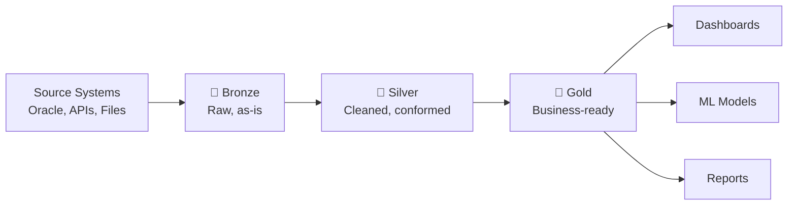

# Medallion Architecture (Bronze / Silver / Gold)

> [!info] Related notes
> [[02 - Delta Lake]] | [[04 - Unity Catalog]] | [[11 - Incremental Loads]]

## What each layer does

| Layer | What it stores | Key operations | Who reads it |
|-------|---------------|----------------|-------------|
| **🥉 Bronze** | Raw data exactly as received. Duplicates, nulls, wrong types — all kept. | Append-only ingestion. Add `_ingested_at`, `_source_file` metadata. | Engineers (debugging, reprocessing) |
| **🥈 Silver** | Cleaned, deduplicated, schema-enforced, conformed. Single source of truth. | [[02 - Delta Lake#MERGE (Upsert)|MERGE]], dedup (ROW_NUMBER), SCD Type 2, joins across entities, null handling. | Engineers, analysts |
| **🥇 Gold** | Business-specific aggregations optimized for consumption. Pre-computed KPIs. | Aggregations, materialized views, star schema dimensional models. | Analysts, dashboards, Power BI, ML |

## Why do we need all three?

> [!question] "If Bronze already has history, why do we need Silver and Gold?"

Bronze has history but it's **raw, messy, and untrusted**:

- **Bronze** = raw ingredients from the market (some bruised, some dirty)
- **Silver** = washed, chopped, prepped ingredients
- **Gold** = finished dishes for different diners

You can't point Power BI at Bronze and get reliable numbers. Silver adds cleaning, dedup, schema enforcement, and joins. Gold adds business-specific pre-aggregations that different teams need:
- Actuarial team needs monthly loss ratios
- Claims ops needs daily counts by adjuster
- Regulatory needs quarterly state-level filings

One Silver table can't serve all these efficiently. Gold pre-computes what each audience needs.

## Delta table settings per layer

| Setting | Bronze | Silver | Gold |
|---------|--------|--------|------|
| [[06 - Storage Optimization#autoOptimize|autoOptimize]] | Optional | **Yes** | **Yes** |
| [[06 - Storage Optimization#Z-ORDER|Z-ORDER]] / [[06 - Storage Optimization#Liquid Clustering|Liquid Clustering]] | No (append-only) | Yes (filter columns) | Yes (query columns) |
| [[06 - Storage Optimization#VACUUM|VACUUM]] schedule | Monthly | Weekly | Weekly |
| Table type | External | External | External (or views) |

---

**Next:** [[04 - Unity Catalog]] →
