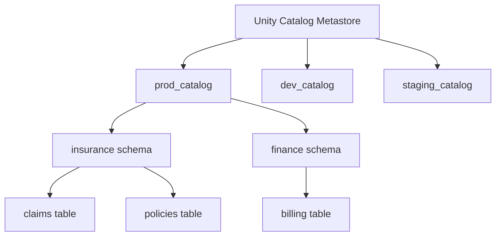

# Unity Catalog

> [!info] Related notes
> [[02 - Delta Lake]] | [[13 - DDL Management]] | [[12 - CICD for Databricks]]

## What is Unity Catalog?

Databricks' **data governance layer**. It provides a 3-level namespace for organizing data:

```
catalog.schema.table

Examples:
  prod_catalog.insurance.claims
  dev_catalog.insurance.claims
  staging_catalog.insurance.claims
```



## Key features

- **Centralized access control:** GRANT / REVOKE at catalog, schema, or table level
- **Data lineage:** Track where data came from and where it goes
- **Audit logging:** Who accessed what data and when
- **Cross-workspace:** Multiple Databricks workspaces share one metastore
- **Per-environment catalogs:** Same table name, different catalog per env

## Permissions

```sql
-- Grant access
GRANT SELECT ON TABLE prod_catalog.insurance.claims TO `analyst_group`;
GRANT ALL PRIVILEGES ON SCHEMA insurance TO `de_team`;

-- Revoke access
REVOKE SELECT ON TABLE prod_catalog.insurance.claims FROM `intern_group`;

-- Switch environments (same code, different catalog)
USE CATALOG ${environment}_catalog;
USE SCHEMA insurance;
SELECT * FROM claims;  -- resolves to dev_catalog.insurance.claims (or prod)
```

## Unity Catalog vs Hive Metastore

| Feature | Hive Metastore (legacy) | Unity Catalog |
|---------|------------------------|---------------|
| Namespace | 2-level: `database.table` | 3-level: `catalog.schema.table` |
| Permissions | Workspace-level only | Fine-grained GRANT/REVOKE |
| Cross-workspace | No | Yes (shared metastore) |
| Data lineage | No | Yes (built-in) |
| Audit logging | Limited | Full |

> [!info] Always use Unity Catalog for new projects
> Hive Metastore is legacy. Unity Catalog is the standard going forward. The 3-level namespace with per-environment catalogs is essential for [[12 - CICD for Databricks|CI/CD]] and [[13 - DDL Management|DDL management]].

---

**Next:** [[05 - Spark Internals]] →
