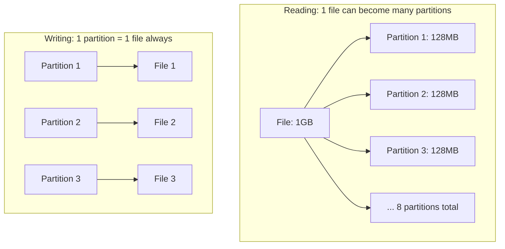
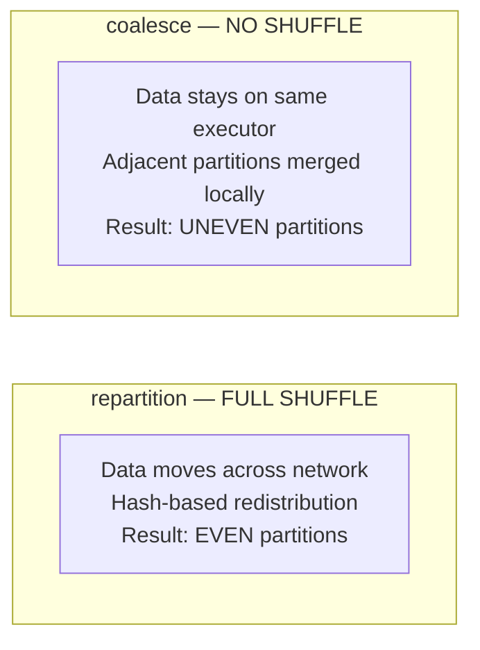

# Spark Internals

> [!info] Related notes
> [[06 - Storage Optimization]] | [[07 - Query Optimization]] | [[15 - Debugging Slow Queries]]

## Partitions — the fundamental unit

A **partition** is a chunk of data that one Spark task processes. This is the single most important concept.



| Direction | Rule | Controlled by |
|-----------|------|---------------|
| **Reading** | 1 file → 1+ partitions (split at ~128MB) | `spark.sql.files.maxPartitionBytes` (default: 128MB) |
| **Writing** | 1 partition → 1 file (always) | Number of partitions in the DataFrame |
| **After shuffle** | Partition count resets to 200 | `spark.sql.shuffle.partitions` (default: 200) |

> [!tip] Key insight
> [[06 - Storage Optimization#OPTIMIZE|OPTIMIZE]] targets ~1GB files for storage efficiency. Spark's reader splits these back into ~128MB partitions for processing. No conflict — large files on disk, small partitions in memory.

## What triggers a shuffle?

A **shuffle** moves data across the network between executors. Most expensive Spark operation.

| Operation | Shuffle? | Why |
|-----------|----------|-----|
| `SELECT`, `filter`, `withColumn` | No | Each partition independent |
| `GROUP BY` | **Yes** | Same keys must be co-located |
| `JOIN` (non-broadcast) | **Yes** | Matching keys must meet |
| `DISTINCT` | **Yes** | Must compare all rows |
| `ORDER BY` | **Yes** | Must sort across all data |
| `Window functions` | **Yes** | PARTITION BY requires co-location |
| `repartition(n)` | **Yes** | Explicit redistribution |
| `coalesce(n)` | **No** | Local merge only |

After any shuffle, Spark creates **200 partitions** (default). If you have 5MB of data after a GROUP BY, you get 200 partitions — most empty. Empty partitions don't create files on write, but the non-empty ones are tiny.

## Repartition vs Coalesce



| Feature | `repartition(n)` | `coalesce(n)` |
|---------|-----------------|---------------|
| Shuffle? | Yes (network transfer) | No (local merge) |
| Even distribution? | Yes | No (keeps existing imbalance) |
| Can increase partitions? | Yes (4 → 200) | No (only decrease) |
| Speed | Slower | Faster |
| Use case | Even distribution, grouping by column | Just reduce output file count |

```python
# Reduce files before writing (prefer coalesce for simple reduction)
df.coalesce(4).write.format("delta").save("/silver/claims")

# Need even distribution or grouping by column
df.repartition(4, "state").write.partitionBy("state").save("/silver/claims")
```

## Data Skew

One partition has far more data than others → one task takes 10x longer → everyone waits.

```
Normal:                     Skewed:
  P0: ████ 100MB             P0: ████ 100MB
  P1: ████ 100MB             P1: ████ 100MB
  P2: ████ 100MB             P2: ████████████████ 1GB  ← bottleneck!
  P3: ████ 100MB             P3: ████ 100MB
```

**Detect:** In Spark UI, compare max task duration vs median. If max is 10x median → skew.

**Fix — salt the join key:**

```python
from pyspark.sql.functions import col, concat, lit, floor, rand, explode, array

# Add random 0-9 suffix to large table's key
df_large = df_large.withColumn("salt", floor(rand() * 10).cast("int")) \
    .withColumn("salted_key", concat(col("policy_id"), lit("_"), col("salt")))

# Replicate small table 10 times (once per salt value)
df_small = df_small.withColumn("salt", explode(array([lit(i) for i in range(10)]))) \
    .withColumn("salted_key", concat(col("policy_id"), lit("_"), col("salt")))

# Join on salted key — skewed policy spread across 10 partitions
result = df_large.join(df_small, "salted_key")
```

## Spill — when memory overflows

When a task's data exceeds memory, Spark **spills** to disk:

| Level | Speed | What happens |
|-------|-------|-------------|
| RAM (no spill) | Baseline | Everything fits. Ideal. |
| Local SSD | 5x slower | Overflows to executor's local disk |
| Remote storage (ADLS) | 50-100x slower | Overflows to cloud storage. Severe. |

> [!warning] Spill ≠ OOM
> Spill **prevents** out-of-memory errors. Too **few** partitions cause spill (each partition too large). Fix: increase `shuffle.partitions`, filter earlier, [[07 - Query Optimization#Broadcast Joins|broadcast]] small tables, larger nodes.

---

**Next:** [[06 - Storage Optimization]] →
