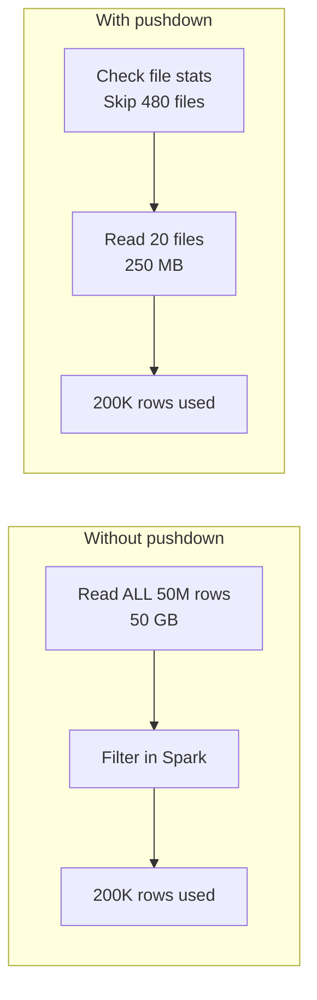

# Query Optimization

> [!info] Related notes
> [[05 - Spark Internals]] | [[06 - Storage Optimization]] | [[15 - Debugging Slow Queries]]

## Predicate Pushdown

**Filtering at the storage level so Spark never reads rows it doesn't need.**



**Works for:**
- **Delta/Parquet:** Reads file footer min/max stats, skips files outside range
- **JDBC (Oracle):** Sends WHERE clause to database, Oracle filters first

### The #1 thing that breaks pushdown

**Wrapping the column in a function:**

```python
# ❌ BAD — pushdown blocked
df.filter(year(col("claim_date")) == 2025)       # function on column
df.filter(upper(col("state")) == "NY")            # function on column
df.filter(col("id").cast("string") == "123")      # function on column

# ✅ GOOD — pushdown works
df.filter(col("claim_date") >= "2025-01-01")      # direct comparison
df.filter(col("state") == "NY")                    # direct comparison
df.filter(col("id") == 123)                        # direct comparison
```

> [!warning] The rule
> Never put a function on the **column** side of a WHERE clause. Functions transform the value, preventing Spark from comparing against file-level min/max stats.

### Verify pushdown is working

```python
df.explain(True)
# Look for "PushedFilters:" in output
# If it shows your conditions → working
# If it shows [] → failed, rewrite your filter
```

### Pushdown for JDBC (Oracle)

```python
# ❌ BAD — reads entire Oracle table, filters in Spark
df = spark.read.jdbc(url, "claims").filter(col("state") == "NY")

# ✅ GOOD — Oracle filters first, only matching rows cross network
df = spark.read.jdbc(url, "(SELECT * FROM claims WHERE state='NY') q")
```

## Adaptive Query Execution (AQE)

AQE dynamically adjusts the query plan **at runtime**. Enabled by default in Databricks.

**Three auto-optimizations:**
1. **Coalesces shuffle partitions:** Merges nearly-empty partitions (200 → 30)
2. **Converts to broadcast join:** If one side is small enough after filtering, switches from sort-merge to broadcast
3. **Handles skew joins:** Splits oversized partitions automatically

## Broadcast Joins

When one table is small enough to copy to every executor, eliminating shuffle of the large table:

```python
# PySpark
from pyspark.sql.functions import broadcast
result = claims.join(broadcast(dim_policy), "policy_id")
```

```sql
-- SQL hint
SELECT /*+ BROADCAST(dim_policy) */ c.*, p.policy_type
FROM claims c JOIN dim_policy p ON c.policy_id = p.policy_id;
```

| Join Type | How | Use when |
|-----------|-----|----------|
| **Broadcast** | Small table copied to all executors | Small side < 100MB |
| **Sort-Merge** | Both shuffled, sorted, merged | Both large |
| **Shuffle Hash** | Smaller shuffled and hashed | Medium tables |

> [!tip] Auto-broadcast threshold
> Default is 10MB. Increase for larger dimensions:
> ```python
> spark.conf.set("spark.sql.autoBroadcastJoinThreshold", "100MB")
> ```

## Pushdown + Z-ORDER = a pair

[[07 - Query Optimization#Predicate Pushdown|Predicate pushdown]] checks min/max stats. [[06 - Storage Optimization#Z-ORDER|Z-ORDER]] makes those stats useful. Without Z-ORDER, every file's range spans everything → nothing skipped. They work together.

---

**Next:** [[08 - Window Functions]] →
