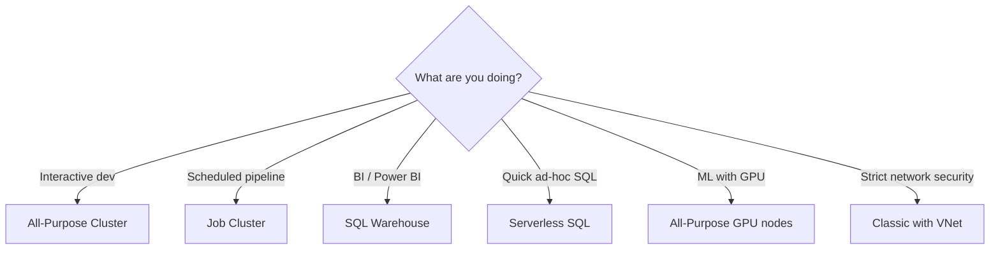

# Compute & Clusters

> [!info] Related notes
> [[14 - Cost Optimization]] | [[15 - Debugging Slow Queries]]

## Cluster Types

| Type | Use case | Cost model | Startup |
|------|----------|-----------|---------|
| **All-Purpose** | Interactive dev, notebooks | Stays running until stopped (or auto-terminate) | 5-10 min |
| **Job Cluster** | Scheduled ETL pipelines | Created per job, auto-terminates when done | 5-10 min |
| **SQL Warehouse (classic)** | BI queries, Power BI | Auto-scales, auto-suspends | ~2 min |
| **SQL Warehouse (serverless)** | Same but Databricks-managed | Instant start, pay per query | ~5 sec |
| **Serverless Jobs** | Scheduled workloads | Pay per DBU, no cluster config | ~30 sec |



## Job Clusters

A job cluster can run a **multi-task workflow** — not just one pipeline:

```
Task 1: Bronze load (claims)        ← runs first
Task 2: Bronze load (policies)      ← runs parallel with Task 1
Task 3: Silver MERGE (claims)       ← depends on Task 1
Task 4: Silver MERGE (policies)     ← depends on Task 2
Task 5: Gold aggregation            ← depends on Tasks 3 & 4
```

All tasks run on the same job cluster. It spins up, runs everything, and auto-terminates. **Zero idle cost.**

## Serverless

**Advantages:** Instant start, zero cluster management, auto-scales, pay per use.

**Disadvantages:**
1. **Cost unpredictability** — you don't control scaling decisions
2. **No spot instances** — can't get 60-80% discount
3. **Limited customization** — no custom libraries, no GPUs, no init scripts
4. **No VNet injection** — blocker for strict network isolation (insurance)
5. **Cold start for notebooks** — 30-60 sec warm-up
6. **Vendor lock-in** — no equivalent outside Databricks

## Spot Instances

Azure Spot VMs cost 60-80% less but can be **evicted** (taken back by Azure) with 30 seconds notice.

| Scenario | Safe for spot? | Why |
|----------|---------------|-----|
| Worker nodes (batch ETL) | ✅ Yes | Spark retries failed tasks on surviving workers |
| Driver node | ❌ No | Losing driver kills the entire job |
| Interactive notebooks | ❌ No | Eviction kills your session |
| Streaming jobs | ❌ No | Restart introduces lag, risks SLA |

**Why batch ETL tolerates eviction:** Your nightly pipeline takes 1 hour but your SLA gives you 7 hours (11 PM to 6 AM). Even if eviction doubles runtime to 2 hours, you finish by 1 AM — 5 hours before deadline. You saved 50%.

```
Safe pattern:
  Driver:  on-demand (always)
  Workers: spot with on-demand fallback
```

## Auto-terminate

All-purpose clusters keep running **forever** until stopped. Always enable auto-terminate:

```
Without: cluster runs 21 hours, you used it for 1 → $168 wasted
With (30 min): stops after 30 min idle → $12 total
```

Job clusters don't need this — they auto-terminate by design.

## Autoscaling

```
Min workers: 2   (keeps cluster responsive, handles single worker failure)
Max workers: 8   (scales up when load increases)
```

All workers are the same VM type. You can't mix sizes within one cluster.

---

**Next:** [[10 - ADF Integration]] →
