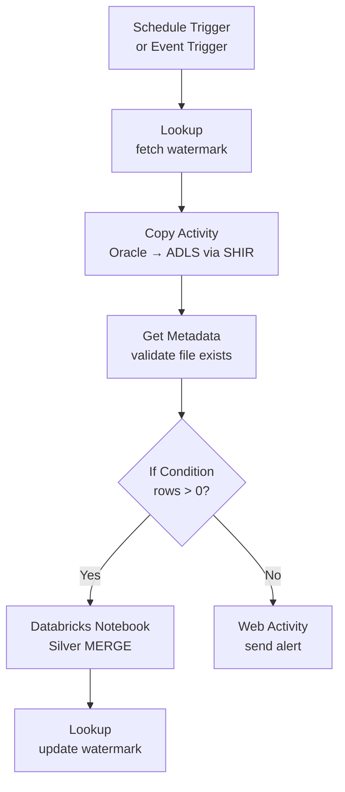

# Azure Data Factory (ADF) Integration

> [!info] Related notes
> [[11 - Incremental Loads]] | [[09 - Compute and Clusters]] | [[12 - CICD for Databricks]]

## Pipeline Pattern



## The 10 Activities You Must Know

| Activity | What it does | Use case |
|----------|-------------|----------|
| **Copy Activity** | Moves data source → sink (90+ connectors) | Oracle → ADLS via SHIR |
| **Data Flow** | Visual Spark transformations | Medium-complexity ETL |
| **Databricks Notebook** | Runs a PySpark notebook from ADF | Complex Silver/Gold transformations |
| **Lookup** | Queries a dataset, returns result | Fetch watermark, check row count |
| **Get Metadata** | File exists? Size? Last modified? | Validate files before loading |
| **If Condition** | Branch on boolean expression | Row count > 0? Proceed or alert |
| **ForEach** | Loop over a list | Process 10 tables from config |
| **Execute Pipeline** | Call a child pipeline | Modular pipeline design |
| **Set Variable** | Store a value between activities | Pass row counts, timestamps |
| **Web Activity** | HTTP call to any API | Send Slack alert, call webhook |

## Triggers (how pipelines start)

| Trigger | How it works | Use case |
|---------|-------------|----------|
| **Schedule** | Cron schedule (daily at 2 AM) | Nightly ETL pipeline |
| **Event (Blob)** | Fires when file created in ADLS | Process file as soon as it arrives |
| **Tumbling Window** | Time-windowed runs with backfill | Hourly processing with retry per window |

## Self-Hosted Integration Runtime (SHIR)

ADF lives in the cloud. Oracle is behind a firewall. SHIR bridges them:

```
ADF (cloud) ←── outbound HTTPS ── SHIR (on-prem VM) ──→ Oracle (on-prem)
                                   same local network
```

- Installed on a Windows VM **inside** the on-prem network
- Only makes **outbound** connections (port 443) — no inbound firewall rules
- Connects to Oracle, SQL Server, file shares locally
- Can run multiple nodes for high availability

> [!tip] Analogy
> SHIR is a person with a badge inside a locked building. ADF calls them and says "grab the package from room 5." SHIR walks there, gets it, and brings it outside. Building security never let a stranger in.

---

**Next:** [[11 - Incremental Loads]] →
