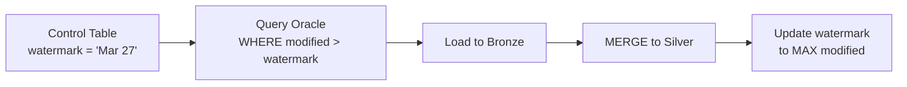

# Incremental Loads

> [!info] Related notes
> [[02 - Delta Lake]] | [[10 - ADF Integration]] | [[03 - Medallion Architecture]]

## Watermark-Based Incremental



```sql
-- 1. Get current watermark
SELECT watermark_value FROM control.watermarks WHERE table_name = 'claims';
-- Returns: '2025-03-27 00:00:00'

-- 2. Extract only new/changed data
SELECT * FROM oracle.claims WHERE last_modified > '2025-03-27 00:00:00';

-- 3. After successful MERGE, advance watermark
UPDATE control.watermarks
SET watermark_value = (SELECT MAX(last_modified) FROM staging.new_claims)
WHERE table_name = 'claims';
```

> [!warning] Advance watermark ONLY after successful load
> If the pipeline fails mid-way, the watermark stays at the old value → next run catches up. If you advance first and the pipeline fails, you lose data.

## Detecting Hard Deletes

Watermark can't see hard deletes — the row doesn't exist anymore, so `WHERE modified > watermark` finds nothing.

### Method 1: Soft Deletes (best)

Ask source team to set `is_deleted = TRUE` instead of physically deleting. The `last_modified` updates → watermark catches it.

```sql
MERGE INTO silver.claims AS target
USING staging.claims_incremental AS source
ON target.claim_id = source.claim_id

WHEN MATCHED AND source.is_deleted = TRUE THEN
  UPDATE SET target.is_active = FALSE, target.deleted_at = source.last_modified

WHEN MATCHED AND source.is_deleted = FALSE THEN
  UPDATE SET target.status = source.status

WHEN NOT MATCHED THEN INSERT *;
```

### Method 2: Full-Key Reconciliation

Periodically extract just the primary keys (lightweight) and compare:

```python
source_ids = spark.read.jdbc(url, "(SELECT claim_id FROM claims) q")
silver_ids = spark.sql("SELECT claim_id FROM silver.claims WHERE is_active = TRUE")
deleted = silver_ids.join(source_ids, "claim_id", "left_anti")
# deleted = IDs in Silver but NOT in Oracle = hard deletes
```

### Method 3: CDC (Change Data Capture)

Use Debezium or Oracle GoldenGate to capture DELETE events from Oracle's redo logs → stream via Kafka.

| Method | Detection speed | Source change needed? | Complexity |
|--------|----------------|----------------------|-----------|
| Soft deletes | Immediate | Yes | Low |
| Full-key reconciliation | Daily/weekly | No | Low-Medium |
| CDC | Real-time | Yes (enable logs) | High |

> [!tip] For insurance
> Soft deletes are preferred — regulators want to know WHAT was deleted and WHEN, not just that something is missing.

---

**Next:** [[12 - CICD for Databricks]] →
