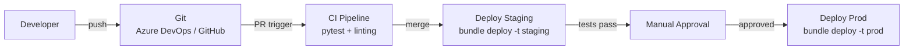

# CI/CD for Databricks

> [!info] Related notes
> [[13 - DDL Management]] | [[04 - Unity Catalog]] | [[09 - Compute and Clusters]]

## Architecture



Three environments: dev → staging → prod. Each maps to a [[04 - Unity Catalog|Unity Catalog]] catalog (`dev_catalog`, `staging_catalog`, `prod_catalog`).

## Databricks Asset Bundles (DABs)

```yaml
# databricks.yml
bundle:
  name: claims-pipeline

resources:
  jobs:
    claims_daily:
      name: "claims_daily_etl"
      tasks:
        - task_key: bronze_load
          notebook_task:
            notebook_path: ./notebooks/bronze_claims.py
        - task_key: silver_merge
          depends_on: [{task_key: bronze_load}]
          notebook_task:
            notebook_path: ./notebooks/silver_claims.py

targets:
  dev:
    workspace: {host: "https://dev-adb.azuredatabricks.net"}
  staging:
    workspace: {host: "https://staging-adb.azuredatabricks.net"}
  prod:
    workspace: {host: "https://prod-adb.azuredatabricks.net"}
    run_as: {service_principal_name: sp-prod-etl}
```

## DABs vs Terraform

| Tool | Use for | Manages |
|------|---------|---------|
| **DABs** | Pipeline code, job definitions, notebook configs | What runs on Databricks |
| **Terraform** | Infrastructure provisioning | Workspaces, Unity Catalog, storage credentials, cluster policies |

Two separate CI/CD pipelines. Terraform for infra, DABs for code.

## Testing Strategy

| Layer | What | When |
|-------|------|------|
| **Unit tests** (pytest) | Test transformation functions in isolation with mock DataFrames | CI, before merge |
| **Integration tests** | Run full pipeline against staging data, validate row counts/schema | After deploy to staging |
| **Data quality tests** | DLT expectations or Great Expectations: null checks, referential integrity | Inside the pipeline itself |

```python
# Unit test example
def test_clean_claims(spark):
    input_df = spark.createDataFrame([
        ("CLM-001", "NY", -500, None),
    ], ["claim_id", "state", "amount", "status"])

    result = clean_claims(input_df)
    assert result.count() == 0  # negative amounts filtered
```

---

**Next:** [[13 - DDL Management]] →
