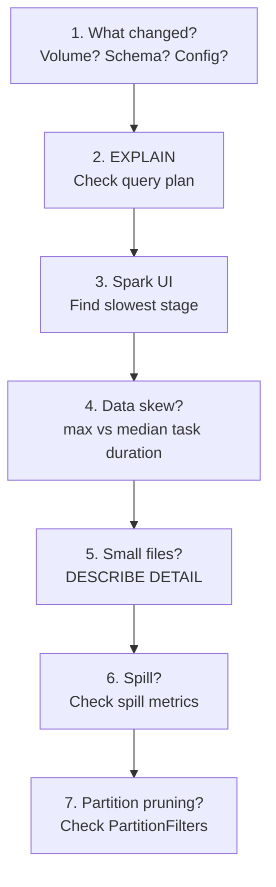

# Debugging Slow Queries

> [!info] Related notes
> [[05 - Spark Internals]] | [[06 - Storage Optimization]] | [[07 - Query Optimization]]

## 7-Step Framework



## Top 5 Root Causes

| Cause | Symptom | Fix |
|-------|---------|-----|
| [[05 - Spark Internals#Data Skew|Data skew]] | One task 10x longer | Salt the join key |
| Wrong join | Sort-merge on small table | [[07 - Query Optimization#Broadcast Joins|Broadcast]] the small table |
| Small files | 200K files, slow planning | [[06 - Storage Optimization#OPTIMIZE|OPTIMIZE]] + VACUUM + autoOptimize |
| No pruning | Full scan with WHERE | Z-ORDER or add partition column |
| [[05 - Spark Internals#Spill|Spill]] | High spill in Spark UI | More shuffle partitions, filter early |

## Diagnostic Commands

```sql
DESCRIBE DETAIL silver.claims;          -- file count, sizes
DESCRIBE HISTORY silver.claims;         -- version history
EXPLAIN EXTENDED SELECT * FROM silver.claims WHERE state = 'NY';
ANALYZE TABLE silver.claims COMPUTE STATISTICS FOR ALL COLUMNS;
```

---

**Next:** [[16 - Databricks vs Snowflake]] →
