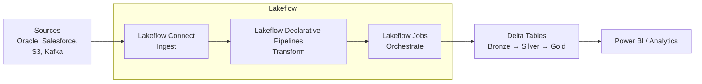
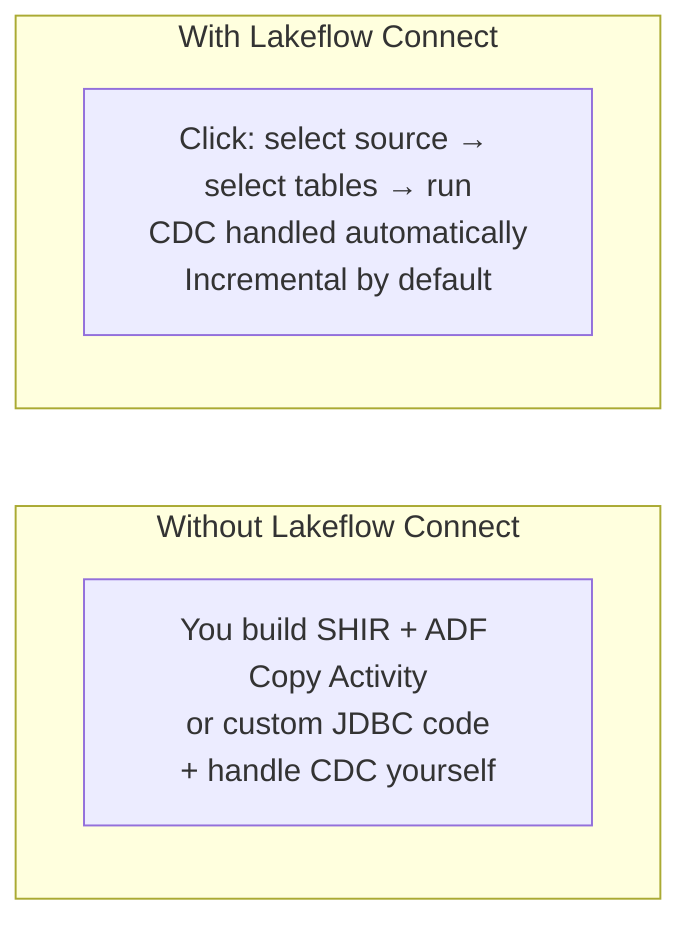
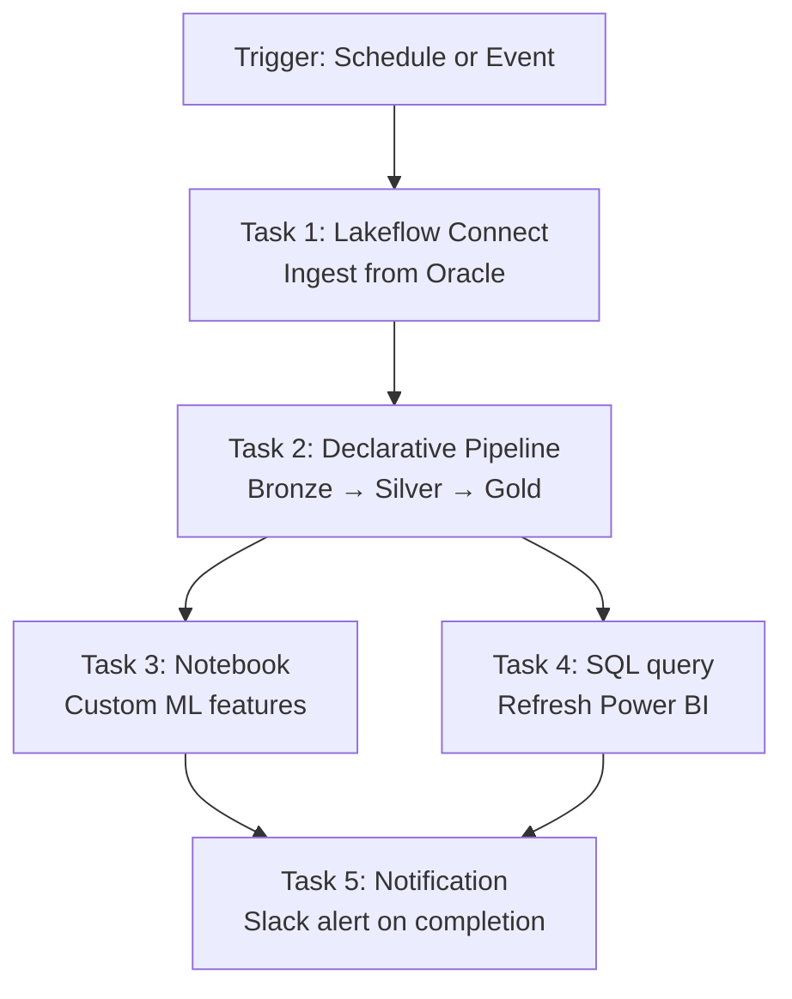

# Databricks Lakeflow

> [!info] Related notes
> [[02 - Delta Lake]] | [[10 - ADF Integration]] | [[11 - Incremental Loads]] | [[06 - Storage Optimization]]

## What is Lakeflow?

Lakeflow is Databricks' **unified data engineering solution** that combines ingestion, transformation, and orchestration into a single product. Instead of stitching together ADF + Databricks notebooks + Airflow + custom connectors, Lakeflow aims to do it all natively inside Databricks.

> [!tip] One-liner
> "Lakeflow = managed connectors (Connect) + declarative ETL (Pipelines) + workflow orchestration (Jobs) — all inside Databricks with Unity Catalog governance."



## The Three Components

### 1. Lakeflow Connect (Ingestion)

Point-and-click managed connectors. No custom code needed for supported sources.

| Source type | Supported connectors |
|------------|---------------------|
| **Databases** | SQL Server, PostgreSQL, Oracle, MySQL (coming), MongoDB (coming) |
| **Enterprise apps** | Salesforce, Workday, ServiceNow, Google Analytics, SharePoint, NetSuite |
| **Cloud storage** | S3, ADLS Gen2, GCS (these already existed as Auto Loader) |
| **Streaming** | Kafka, Kinesis, Event Hub, Pub/Sub |
| **Files** | SFTP (coming), local uploads, volumes |

**Key features:**
- Uses **Change Data Capture (CDC)** under the hood for database connectors — reads transaction logs instead of full table scans
- Incremental processing by default — only new/changed data is ingested
- Governed by [[04 - Unity Catalog|Unity Catalog]] — lineage, permissions, audit out of the box
- Runs on **serverless compute** — no cluster to configure



> [!info] How it relates to ADF
> Lakeflow Connect can replace ADF Copy Activity for supported sources. Instead of ADF → ADLS → Databricks notebook, you go directly from source → Delta table inside Databricks. However, ADF is still needed for sources that Lakeflow Connect doesn't support yet, or for complex orchestration patterns that span beyond Databricks.

### 2. Lakeflow Declarative Pipelines (Transformation)

Formerly known as **Delta Live Tables (DLT)**. You write declarative SQL or Python that says **WHAT** you want, not HOW to process it. Lakeflow handles the operational complexity.

```sql
-- Declarative SQL — you declare the result, Lakeflow handles the how
CREATE OR REFRESH STREAMING TABLE bronze_claims
AS SELECT * FROM cloud_files('/raw/claims/', 'json');

CREATE OR REFRESH STREAMING TABLE silver_claims (
  CONSTRAINT valid_amount EXPECT (amount > 0) ON VIOLATION DROP ROW
)
AS SELECT
  claim_id,
  CAST(amount AS DOUBLE) AS amount,
  state,
  claim_date
FROM STREAM(LIVE.bronze_claims);

CREATE OR REFRESH LIVE TABLE gold_claims_summary
AS SELECT
  state,
  DATE_TRUNC('month', claim_date) AS month,
  COUNT(*) AS claim_count,
  SUM(amount) AS total_amount
FROM LIVE.silver_claims
GROUP BY state, DATE_TRUNC('month', claim_date);
```

**What Lakeflow handles automatically:**
- Incremental processing (only new data)
- Dependency ordering (Bronze before Silver before Gold)
- Retry on failure
- Autoscaling compute
- Data quality monitoring (EXPECT constraints)

**Key concepts:**

| Concept | What it means |
|---------|-------------|
| `STREAMING TABLE` | Processes data incrementally (append-only, like Auto Loader) |
| `LIVE TABLE` | Materialized view — recomputed when dependencies change |
| `EXPECT` | Data quality constraint — can WARN, DROP ROW, or FAIL on violation |
| `STREAM(LIVE.table)` | Read another pipeline table as a stream |
| `cloud_files()` | Auto Loader function — ingests new files automatically |

### 3. Lakeflow Jobs (Orchestration)

This is what we already know as **Databricks Workflows / Jobs**. Lakeflow Jobs is the rebranded name with additional capabilities:

- Multi-task workflows with dependency DAGs
- Schedule triggers, file triggers, continuous triggers
- Parameterized notebooks
- Monitoring and alerting
- [[12 - CICD for Databricks|CI/CD]] via Databricks Asset Bundles



### Lakeflow Designer (No-Code)

An **AI-powered visual pipeline builder** for non-developers. Drag-and-drop interface that generates the same governed pipelines as code-first approaches. Business analysts can build production pipelines without writing SQL or Python.

> [!info] Key point
> Both no-code (Designer) and code-first (Declarative Pipelines) produce the same result: an auditable pipeline governed by Unity Catalog. Same output, different input methods.

## Lakeflow vs Traditional Approach

| Aspect | Traditional (ADF + Notebooks) | Lakeflow |
|--------|------------------------------|----------|
| **Ingestion** | ADF Copy Activity + SHIR + custom JDBC | Lakeflow Connect (point-and-click, CDC built-in) |
| **Transformation** | PySpark notebooks (imperative code) | Declarative SQL/Python (you say WHAT, not HOW) |
| **Data quality** | Manual checks or Great Expectations | Built-in EXPECT constraints with DROP/WARN/FAIL |
| **Orchestration** | ADF pipeline or Airflow | Lakeflow Jobs (native Databricks) |
| **Incremental processing** | You build watermark logic | Automatic (streaming tables handle it) |
| **Compute** | You configure clusters | Serverless (for Connect) or auto-managed |
| **Governance** | Manual lineage tracking | Automatic via Unity Catalog |
| **Complexity** | High (multiple tools to stitch) | Lower (single platform) |
| **Flexibility** | Maximum (full code control) | Less (constrained by declarative model) |

## When to use Lakeflow vs Traditional

> [!tip] Use Lakeflow when
> - Source is supported by Lakeflow Connect
> - Transformations are standard (filter, join, aggregate, SCD)
> - You want built-in data quality and lineage
> - Team prefers declarative over imperative code
> - You want to minimize operational overhead

> [!warning] Stick with traditional (ADF + notebooks) when
> - Source isn't supported by Lakeflow Connect yet
> - Complex custom transformations that don't fit declarative model
> - You need ADF's broader orchestration (non-Databricks tasks)
> - Organization already has mature ADF + notebook patterns
> - Need maximum flexibility and control

## For the EXL Role

The EXL JD mentions ADF + Databricks notebooks, which is the **traditional approach**. Lakeflow may not be what the client uses today. However, knowing Lakeflow shows you're aware of where Databricks is heading.

> [!tip] Interview angle
> "The current architecture uses ADF for orchestration and Databricks notebooks for transformations, which gives us maximum control. I'm also aware of Lakeflow, Databricks' newer unified approach that combines ingestion, transformation, and orchestration natively. As Lakeflow matures and supports more connectors — especially Oracle, which is our primary source — it could simplify the architecture by reducing our dependency on ADF for ingestion. I'd evaluate it for new pipelines while keeping the existing ADF-based ones stable."

## DLT / Declarative Pipelines — Data Quality Example

One of the most valuable features is built-in data quality constraints:

```sql
-- Bronze: ingest raw (no quality checks)
CREATE OR REFRESH STREAMING TABLE bronze_claims
AS SELECT * FROM cloud_files('/raw/claims/', 'parquet');

-- Silver: clean with quality gates
CREATE OR REFRESH STREAMING TABLE silver_claims (
  -- Warn but keep the row
  CONSTRAINT valid_state EXPECT (state IS NOT NULL) ON VIOLATION DROP ROW,
  
  -- Drop bad rows silently
  CONSTRAINT positive_amount EXPECT (amount > 0) ON VIOLATION DROP ROW,
  
  -- Fail the entire pipeline if this breaks
  CONSTRAINT unique_claim EXPECT (claim_id IS NOT NULL) ON VIOLATION FAIL UPDATE
)
AS SELECT
  claim_id,
  UPPER(state) AS state,
  CAST(amount AS DOUBLE) AS amount,
  TO_DATE(claim_date_str, 'yyyy-MM-dd') AS claim_date,
  current_timestamp() AS processed_at
FROM STREAM(LIVE.bronze_claims);
```

The pipeline dashboard shows exactly how many rows passed, were dropped, or failed each constraint — visible in the Databricks UI without any extra monitoring setup.

---

← Back to [[00 - Index]]
